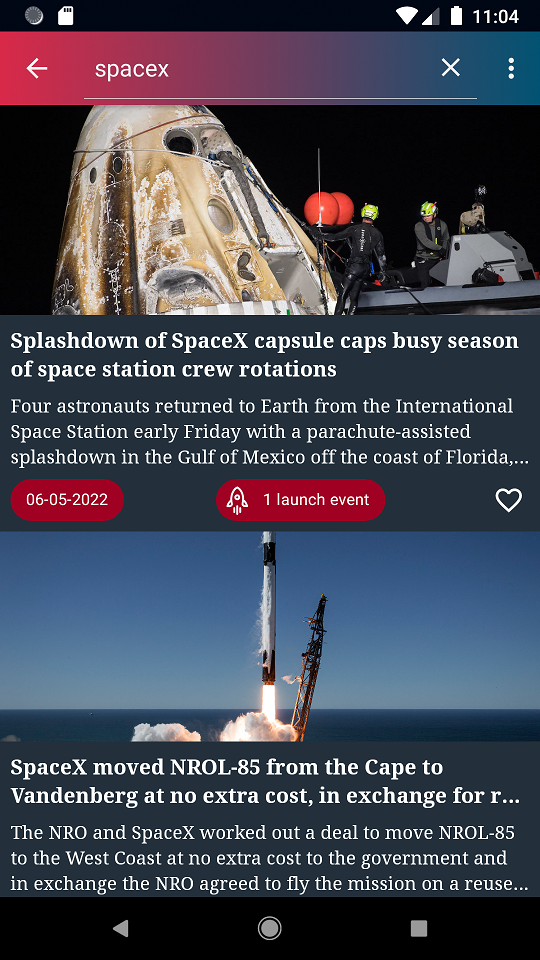
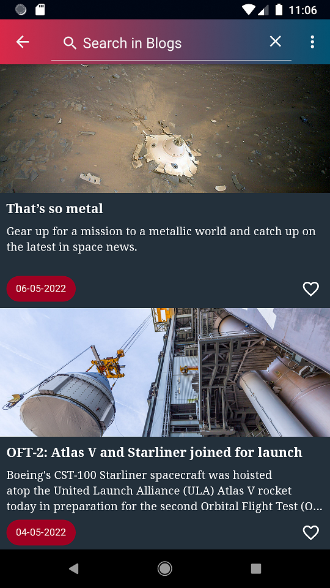
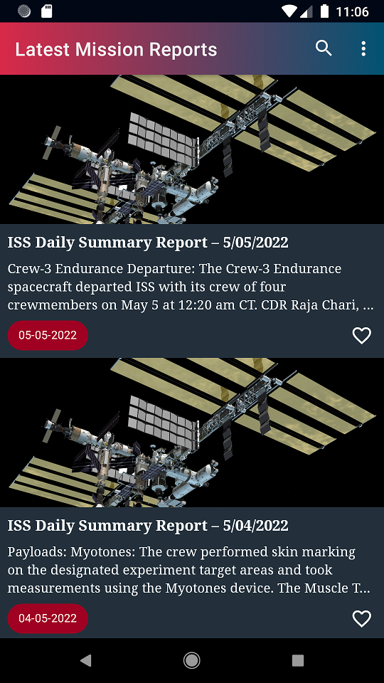

# AstraNovos by chicorasia :rocket:

A SpaceFlightNews API client for Android. It was created for a series of instructional videos on YouTube. 

- **API consumption**. The app consumes eht SpaceFlightNews Api (https://spaceflightnewsapi.net/).
- **MVVM architecture**. The app is based on modern Android components and MVVM architecture.
- **Clean Architecture**. It's development follows clean architecture practices, such as separation of core, domain, data and presentation layers.
- **UX/UI**. Creating a modern, crisp and accessible interface using Google Material Design components.
- **Cyrillic, Latin and Greek support**. Use of a font family with support for different character sets.
- **Coroutines**. Extensive use of coroutines for remote data access and other operations.
- **Flow**. Use of flows instead of LiveData.
- **Automated Testing & TDD**. Automated unit and integration tests using JUnit4 and KoinTest.
- **Flexible UseCase class**. Employ inheritance to create a flexible `UseCase<Param, Source>` class.
- **Flexible State class**. The app uses a flexible `State<T>` wrapper class capable of handling responses with type safety.
- **MockWebServer**. Use for mocking services.
- **Dependency injection with Koin**.
- **Fragment-based navigation**.

Follow the project on my YouTube channel: https://www.youtube.com/channel/UCUtGvO3euBPoR7skowqtj-Q/featured

## Versions
### Version 0.1
- Basic functionality: retrieve latest Articles, Blog Posts and Mission Reports from the SpaceFlightNewsAPI
- Branded Aesthetics

### Version 0.2
- Search Articles, Blog Posts and Mission Reports by title

## Screenshots:

****
:computer: chicorialabs.com.br/blog
